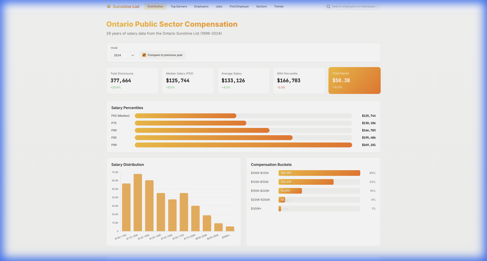

# ☀️ Ontario Sunshine List Explorer

[Website](https://whatdoesthefoxsay2u.github.io/Sun-Shine-List/) : An interactive visualizations dashboard for exploring **29 years** of Ontario public sector salary disclosure data (The "Sunshine List"). 

This project transforms millions of raw government records (1996-2024) into a fast, static web experience that allows users to analyze trends, search for individuals, and compare employers across the province.



## 🚀 Live Demo
*(Add your Netlify/GitHub Pages link here)*

## 📂 Project Structure

The repository is divided into two main components:

### 1. `website/` (The Frontend)
A lightweight, high-performance static web application.
- **No Frameworks**: Built with Vanilla JavaScript, HTML5, and CSS3 for maximum speed.
- **Key Libraries**: 
  - [Chart.js](https://www.chartjs.org/) for interactive data visualizations.
  - [Fuse.js](https://fusejs.io/) for powerful client-side fuzzy searching.
- **Data**: Consumes pre-computed JSON analytics from the `data/` directory (decoupled from the backend).

### 2. `API/` (The Data Pipeline)
A Python-based ETL (Extract, Transform, Load) pipeline that processes raw data into app-ready analytics.
- **Stack**: Python 3.9+, Pandas, PyArrow.
- **Workflow**:
  1.  **Ingest**: Reads raw CSV files (`API/raw/`).
  2.  **Cleanse**: Normalizes employer names, job titles, and fixes data inconsistencies.
  3.  **Enrich**: Links individuals across years to track career progression.
  4.  **Analyze**: Aggregates data into compact JSON files (`API/analytics/`) for the frontend.

---

## 🛠️ Quick Start

### Prerequisites
- Python 3.9+ (for data processing)
- Any modern web browser

### Running the Website Locally
You can run the fully static website using the included helper script:

```bash
./start_website.sh
```
Open [http://localhost:8080/website/index.html](http://localhost:8080/website/index.html) in your browser.

---

## ⚙️ Data Pipeline Usage

If you want to update the data or regenerate the analytics:

1. **Install Dependencies**:
   ```bash
   pip install pandas pyarrow numpy
   ```

2. **Run the Pipeline**:
   The master script runs all stages (Ingest -> Clean -> Analytics).
   ```bash
   python API/scripts/run_pipeline.py
   ```
   
   *Options:*
   - `--stage ingest`: Only convert raw CSVs to Parquet.
   - `--stage analytics`: Regenerate website JSON files.

---

## 📊 Features

*   **Time Travel**: Visualize the evolution of public sector pay from 1996 to today.
*   **Search**: Instantly find any of the ~3M records by name, employer, or job title.
*   **Employer Rankings**: Score and rank employers based on Pay, Retention, and Growth.
*   **Inflation Adjustment**: View salary trends adjusted for CPI.
*   **Sector Analysis**: Compare compensation across Health, Education, Government, etc.

## 📝 License
Data provided by the [Government of Ontario](https://www.ontario.ca/page/public-sector-salary-disclosure) under the Open Government Licence – Ontario.
Application code is MIT Licensed.
